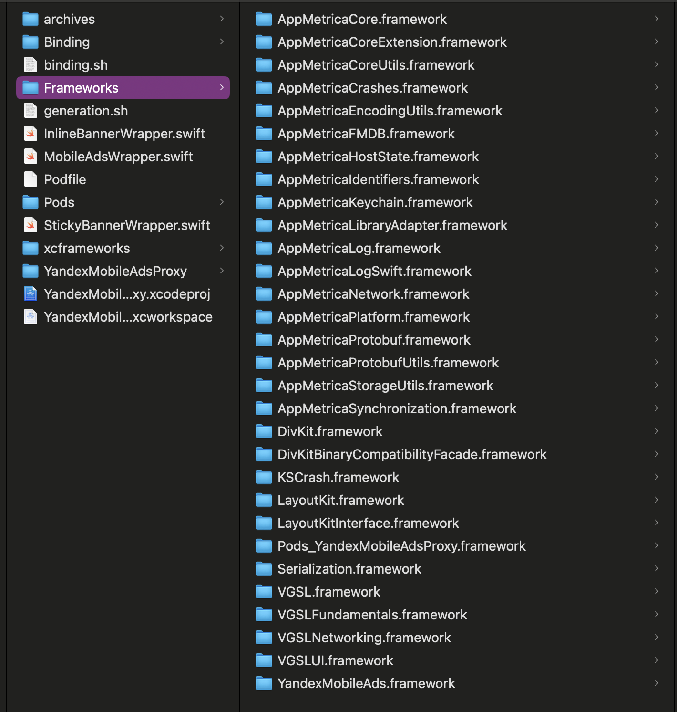

Source: https://github.com/Serenity112/Net.YandexMobileAds

### Что делает проект?

Это проект для создания .NET for iOS обёртки для библиотеки YandexMobileAds. (Android возможно появится в будущем)
Исходник написан на swift: 
https://ads.yandex.com/helpcenter/ru/dev/platforms
### Что за версия обернута?
Версией для обертки была выбрана 7.8.0. Яндекс постоянно меняют библиотеку, усложняя и переписывая её, поэтому каждая новая обертка - отдельная пытка. Новые версии (по типу 7.13.* ) имеют свои трудности, поэтому я выбрал минимальную более-менее стабильную.
### Почему такой эзотерический способ обёртки? Почему не по официальным канонам?
Есть общепринятые способы создания обёрток, как прямых, так и прокси.
На эту тему есть официальный гайд от Microsoft:
https://learn.microsoft.com/ru-ru/previous-versions/xamarin/ios/platform/binding-swift/walkthrough
А также очень полезная статья по исправлению ошибок биндинга
https://debruyn.dev/2016/creating-a-xamarin.ios-binding-project-for-dummies/

В этом файле я не буду давать гайд на обертки, а лишь расскажу специфику конкретно этой. Вне зависимости от выбранного способа обертки (прямая/прокси), важным шагом является добавление исходного .xcframework в .NET iOS проект как NativeReference, что-то в духе:

`<ItemGroup>`  
    `<NativeReference Include="YandexMobileAds.xcframework">`  
        `<Kind>Framework</Kind>`  
        `<ForceLoad>...</ForceLoad>`  
        `<Frameworks>...</Frameworks>`  
        `<LinkerFlags>...</LinkerFlags>`  
    `</NativeReference>`  
`</ItemGroup>`

И на этом этапе появляется проблема - xcframework YandexMobileAds ни в какую не подключается к проекту как NativeReference. При компиляции проекта выдаёт следующее:

`Xamarin.Shared.Sdk.targets(1648, 3): clang++ exited with code 1: Undefined symbols for architecture arm64: "AppMetricaLibraryAdapter.AppMetricaLibraryAdapter.reportEvent(sender: Swift.String, event: Swift.String, payload: Swift.String, onFailure: ((Swift.Error) -> ())?) -> ()", referenced from: MACAnalytics.MACAnonymousMetricaReporter.report(event: Swift.String, parameters: [Swift.String : Any], rawImpressionData: Swift.String?) -> () in YandexMobileAds[arm64][1085](http://macanonymousmetricareporter.o/) "static AppMetricaLibraryAdapter.AppMetricaLibraryAdapter.shared.getter : AppMetricaLibraryAdapter.AppMetricaLibraryAdapter", referenced from: MACAnalytics.MACAnonymousMetricaReporter.**allocating_init() -> MACAnalytics.MACAnonymousMetricaReporter in YandexMobileAds[arm64][1085](http://macanonymousmetricareporter.o/) MACAnalytics.MACMetricaAnalyticsTrackerFactory.makeAppAnalyticsTracker(statisticSendingEnabled: Swift.Bool) -> MACAnalytics.MACAppAnalyticsTracker in YandexMobileAds[arm64][1089](http://macmetricaanalyticstrackerfactory.o/) default argument 1 of MACAnalytics.MACMetricaAnalyticsTrackerFactory.init(analyticsEventTrackerProvider: MACAnalytics.MACAnalyticsEventTrackerProvider, adsMetricaAnalyticsTrackerFactory: MACAnalytics.MACAdsMetricaAnalyticsTrackerFactory) -> MACAnalytics.MACMetricaAnalyticsTrackerFactory in YandexMobileAds[arm64][1108](http://macanalyticsprovider.o/) "AppMetricaLibraryAdapter.AppMetricaLibraryAdapter.activate() -> ()", referenced from: MACAnalytics.MACAnonymousMetricaReporter.activate() -> () in YandexMobileAds[arm64][1085](http://macanonymousmetricareporter.o/) protocol witness for MACAnalytics.MACAnonymousMetricaReporting.activate() -> () in conformance MACAnalytics.MACAnonymousMetricaReporter : MACAnalytics.MACAnonymousMetricaReporting in MACAnalytics in YandexMobileAds[arm64][1085](http://macanonymousmetricareporter.o/) "type metadata accessor for AppMetricaLibraryAdapter.AppMetricaLibraryAdapter", referenced from: MACAnalytics.MACAnonymousMetricaReporter.**allocating_init() -> MACAnalytics.MACAnonymousMetricaReporter in YandexMobileAds[arm64][1085](http://macanonymousmetricareporter.o/) MACAnalytics.MACMetricaAnalyticsTrackerFactory.makeAppAnalyticsTracker(statisticSendingEnabled: Swift.Bool) -> MACAnalytics.MACAppAnalyticsTracker in YandexMobileAds[arm64][1089](http://macmetricaanalyticstrackerfactory.o/) default argument 1 of MACAnalytics.MACMetricaAnalyticsTrackerFactory.init(analyticsEventTrackerProvider: MACAnalytics.MACAnalyticsEventTrackerProvider, adsMetricaAnalyticsTrackerFactory: MACAnalytics.MACAdsMetricaAnalyticsTrackerFactory) -> MACAnalytics.MACMetricaAnalyticsTrackerFactory in YandexMobileAds[arm64][1108](http://macanalyticsprovider.o/) "nominal type descriptor for AppMetricaLibraryAdapter.AppMetricaLibraryAdapter", referenced from: _symbolic **_** 24AppMetricaLibraryAdapterAAC in YandexMobileAds[arm64][1085](http://macanonymousmetricareporter.o/) "static DivKitBinaryCompatibilityFacade.DivKitFacade.createView(json: [Swift.String : Any], localImageProvider: DivKitBinaryCompatibilityFacade.LocalImageProviding?, fontProvider: DivKitBinaryCompatibilityFacade.FontProviding?, customViewFactory: DivKitBinaryCompatibilityFacade.ContentViewFactory?, wrapperConfigurators: [DivKitBinaryCompatibilityFacade.WrapperViewConfigurator], urlHandler: DivKitBinaryCompatibilityFacade.UrlHandling) async -> __C.UIView", referenced from: (1) suspend resume partial function for closure #1 () async -> () in MACDivKit.MACDivKitViewImpl.useDesign(_: MACDivKit.MACDivKitDesign, resourceProviders: [MACDivKit.MACDivKitResourceProvider], completion: () -> ()) -> () in YandexMobileAds[arm64][1470](http://macdivkitview.o/) "async function pointer to static DivKitBinaryCompatibilityFacade.DivKitFacade.createView(json: [Swift.String : Any], localImageProvider: DivKitBinaryCompatibilityFacade.LocalImageProviding?, fontProvider: DivKitBinaryCompatibilityFacade.FontProviding?, customViewFactory: DivKitBinaryCompatibilityFacade.ContentViewFactory?, wrapperConfigurators: [DivKitBinaryCompatibilityFacade.WrapperViewConfigurator], urlHandler: DivKitBinaryCompatibilityFacade.UrlHandling) async -> __C.UIView", referenced from: (1) suspend resume partial function for closure #1 () async -> () in MACDivKit.MACDivKitViewImpl.useDesign(_: MACDivKit.MACDivKitDesign, resourceProviders: [MACDivKit.MACDivKitResourceProvider], completion: () -> ()) -> () in YandexMobileAds[arm64][1470](http://macdivkitview.o/) "protocol descriptor for DivKitBinaryCompatibilityFacade.DivKitFacadeWrapperView", referenced from: l_got.$s31DivKitBinaryCompatibilityFacade0abE11WrapperViewMp in YandexMobileAds[arm64][1451](http://macaddivwrapperblock.o/) l_got.$s31DivKitBinaryCompatibilityFacade0abE11WrapperViewMp in YandexMobileAds[arm64][1476](http://macaddivbuttonblockview.o/) l_got.$s31DivKitBinaryCompatibilityFacade0abE11WrapperViewMp in YandexMobileAds[arm64][1477](http://macaddivimageblockview.o/) l_got.$s31DivKitBinaryCompatibilityFacade0abE11WrapperViewMp in YandexMobileAds[arm64][1478](http://macaddivlabelblockview.o/)`

Эту проблему устранить не удалось, поэтому нам обрубаются сразу оба способа создания обёртки - и прямой (через простое создание ApiDefinition), и прокси (через создания дополнительного xcframework). Что же делать? Бизнес ждёт. Пришлось собирать библиотеку по кусочкам из зависимостей. Об этом и пойдет речь дальше.

### Как работает сборка проекта?

Как упоминалось выше, проект собирается по кусочкам из зависимостей. Пройдемся по всем этапам.
Они взяты из .pdf файла, который я положил в корень проекта. Однако есть ряд комментариев, которые я бы хотел дать.

1) Pod-зависимость
Добавим зависимость на Яндекс Рекламу через cocoapods, создав podfile через `pod init`
Установим зависимости через команду `pod install`
После этого этапа папка Pods заполнится исходниками зависимостей.
Обратив внимание на строку `use_frameworks! :linkage => :static` в podfile.
Это необходимо для статической линковки, чтобы все зависимости упаковывались в результирующий бинарник.

2) Соберем pod-проект
После сборки проекта, в папке Products (в DerivedData) мы получим набор папок, в которых будут лежать наши .framework библиотеки. Обратим внимание, что делать сборку мы можем для разных архитектур - для arm64 девайса, или для arm64/x86_64 эмулятора. Можно начать с любой архитектуры. Узнать, к какой архитектуре принадлежит собранный .framework можно по его info.plist файлу.

3) Спорный этап. Копируем все .framework в корень проекта
Все .framework файлы из папки Products/iphoneos копируем в корень проекта, или в какую-то папку, у меня это папка Frameworks. После чего подключаем все зависимости в проект как "Do not embed". Единственное что мы не копируем - .framework самого нашего проекта. Не нужно его дублировать в свои же зависимости.

4) Пишем код обертки
Создаем наши swift файлы для обёртки, обращаясь к нативным методам. Важно обратить внимание на то, что это всё же прокси-библиотека, и вызовы никаких из нативных классов не будут доступны в c# приложении, никак отдельные классы, ни как аргументы в методах. c# будет видеть только те классы, что мы сами напишем и пометим как @objc. Соответственно, если нам надо передавать какие-то структуры в методы, нужно городить много оберточных структур, и конвертировать их в нативные в нашем swift коде.

5) Повторная сборка проекта
Теперь нам надо собрать проект ещё раз, имея все зависимости запакованные в папке проекта. Первая сборка была для генерации зависимостей, сейчас же мы пересобираем проект с подключенными. Мы стремимся получить .xcframework для архитектур айфона + эмулятора, поэтому можно собирать любым удобным нам способом. Я делаю это через `xcodebuild archive`.

6) Сборка для другой архитектуры
Как я упоминал раньше, мы хотим получить .xcframework файл с разными архитектурами. Для этого нам нужно получить 2 .framework (xcarchive) для айфона и эмулятора. Проблема в том, что мы НЕ можем просто сделать билд текущего проекта для разных архитектур. У нас ручное подключение исходников, которые уже собраны под конкретную архитектуру. А значит надо поменять архитектуру, собрать заново .framework файлы для другой архитектуры, закинуть их снова в папку Frameworks, и уже в 4й раз собрать проект для получения второго архива.

7) Получаем итоговый .xcframework
Этот xcframework готовы быть обернутым для c# проекта. Объединяем архивы через `xcodebuild -create-xcframework` 

Но есть и хорошая новость! Я написал bash-script который делает всё это сам. Он лежит в корне iOS проекта как `generation.sh`. Всё что нужно сделать перед его запуском - восстановить pod-ы через `pod install`. После этого можно запускать скрипт, и вы получите файл xcframeworks/YandexMobileAdsProxy.xcframework
### Обёртка прокси-либы
Делаем обертку через утилиту objective sharpie. Подробнее про это можно почитать по ссылке выше в гайде от Microsoft, я же оставлю скрипт binding.sh который сделает обертку в Binding/ApiDefinitions.cs.
В скрипте захардкодена версия iOS sdk 18.2. Можете заменить её на свою актуальную, но у меня с sdk 18.4 генерировался кривой ApiDefinitions. Быть может apple что-то сломали.

### Сборка c# библиотеки
Теперь делаем классическую обертку, она реализована в проекте Net.YandexMobileAds.iOS. Билдим, и берем результат в папке /bin/

### Использование
Использование отличается от нативного.
1) Для инициализации библиотеки:
`MobileAdsWrapper.InitializeSDK();`

2) Далее же для загрузки рекламы идёт танец с бубном. 
- Создаём экземпляр баннера:
`var inlineBannerWrapper = new InlineBannerWrapper(adUnitID: "demo-banner-yandex", 300f, 100f);`

- Создаем словарь с значениями рекламы (берём из личного кабинета Яндекса):
`var parameters = new NSMutableDictionary<NSString, NSString>();`
(для тестового баннера он пустой)

- Загружаем рекламу:
`inlineBannerWrapper.LoadAdWithRequestWithParam(parameters);`

- Используем загруженный экземпляр
Сам экземпляр AdView хранится как UiView внутри оберточного класса. Можно добавить его заранее, или по факту загрузки:
`vc.View.AddSubview(inlineBannerWrapper.View);`
### Тестирование
Сделал тестовый проект, Playground.iOS. Он в зависимостях смотрит как раз на:
`<ItemGroup>`  
    `<Reference Include="Net.YandexMobileAds.iOS">`  
        `<HintPath>..\Net.YandexMobileAds.iOS\bin\Release\net8.0-ios\Net.YandexMobileAds.iOS.dll</HintPath>`  
    `</Reference>`  
`</ItemGroup>`

То есть на результат билда библиотеки. Но чтобы не повторять весь путь до этого, дабы её получить - в Release гитхаба будет лежать уже готовый xcframework + .dll для подключения к проекту. Ссылаемся мы на dll, но .xcframework должен лежать рядом в папке .resources

### Известные баги/ошибки/недоработки
1. Только arm64
Несмотря на то что я делаю либу для x86_64 эмулятора, загрузка рекламы работает только на ARM64 процессоре. То есть либо на девайсах, либо arm эмуляторах. Если вы насильно запускаете эмуляторы в x86_64 архитектуре, например через `<ForceSimulatorX64ArchitectureInIDE>true</ForceSimulatorX64ArchitectureInIDE>`, то убедитесь что вы не вызываете метод `LoadAdWithRequestWithParam` или схожий. Приложение упадёт. Поэтому сделайте условие на методы загрузки, чтобы он не вызывался на 86_64 архитектуре, а только на arm.

2. Не работает в дебаге.
Я не имею ни малейшего понятия почему, но если запустить проект в Debug режиме, то также в момент загрузки рекламы через метод `LoadAdWithRequestWithParam` или схожий, приложение упадет. Можно запускать просто через Run, без дебага. Я советую как и в прошлой проблеме просто отключить загрузку рекламы в DEBUG, и оставить её только в RELEASE + ARM64 конфигурациях.

3. Реализованы не все методы
Обертка писалась под бизнес задачу, я обернул только Inline и Sticky баннеры. Там есть ещё разные типы рекламы, может быть доделаю потом.
